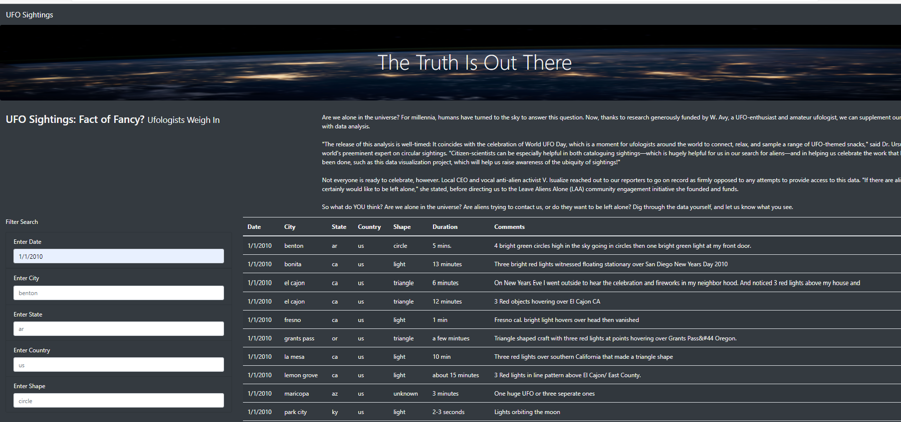

# UFOs
## Overview of the analysis:
   In this project Dana created UFOs Sightings with Java script visual functionality and she created a webpage and dynamic table with date as filter.But,Dana would like to 
   provide in-depth analysis of UFO sightings so she wants her users to filter for multiple criteria at the same time. So we are assigned to help her to create table and add more
   filter parameters like city,shape,country and shape.
   
 ## Results :

   In addition to the date filter created in this module,we added  filters for the city, state, country, and shape, as shown in the following image:
   The page appears like below when land on the page with filters.
  
  
  
  When type the date on placeholder elementas ,for example type  1/1/2010 on Enter Date ,you can see the matches as like in below image.
  
 
  
  ## Summary :
  
  ### Drawback :
      The user has to use full date format to search instead of just the month or year.Also, the filters requires lower case only.
      
  ### Recommendation
  
    1) If clear filter button  added that would be easy for the user to reset the page
    2)A filter on range  for date is a recommended criteria; example- 2010
    
