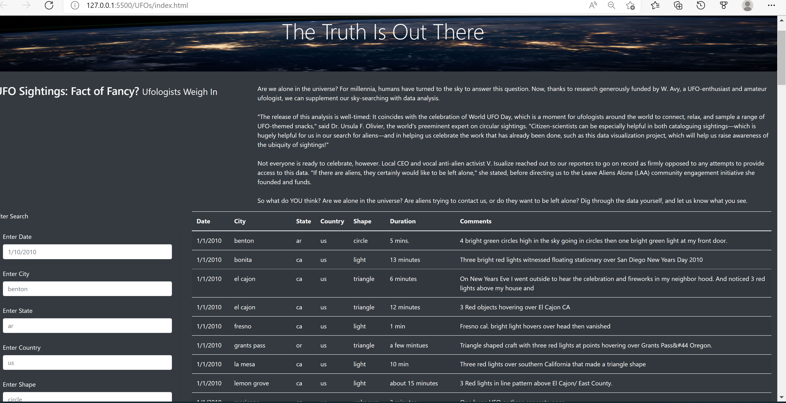

# UFOs
## Overview of the analysis:
   In this project Dana created UFOs Sightings with Java script' visual functionality and she created webpage and dynamic table with date as filter.But,Dana would like to 
   providein-depth analysis of UFO sightings so she wants her users to filter for multiple criteria at the same time. So we are assigned to help her to create table and add more
   filter parameters like city,shape,country and shape.
   
 ## Results :

   In addition to the date filter created in this module,we added  filters for the city, state, country, and shape, as shown in the following image:
  
  
  
    
